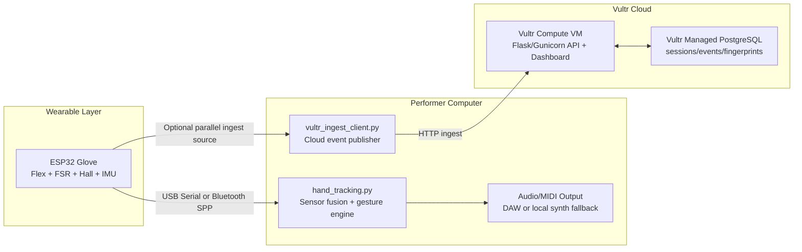

# GestureHand: Hybrid Glove + Camera Music Interface

Wearable musical interface that fuses:
- ESP32 glove sensors (flex, FSR thumb pad, hall sensors, IMU)
- Camera hand tracking (MediaPipe)
- Real-time audio/MIDI generation
- Vultr-hosted ingestion + performance fingerprinting

## What this project does

- Turns hand motion + glove sensor data into notes, chords, and expressive effects.
- Streams performance telemetry to a Vultr-hosted backend.
- Stores every session as structured event data in Vultr Managed PostgreSQL.
- Computes a reproducible "performance fingerprint" per session for provenance.

## System Architecture



## Vultr Utilization (judge-facing)

- **Vultr Compute**: hosts API + live dashboard (`vultr_backend.py`) with systemd service.
- **Vultr Managed Database (PostgreSQL)**: persists all session/event/fingerprint records.
- **Public endpoint**: supports start/ingest/stop flow for real-time performance capture.
- **Scalable design**: ingestion API is stateless; storage and compute are separated.

## Quick Start

### Fastest friend-laptop run

```bash
cd /Users/patliu/Desktop/Coding/MakeMIT2026
./scripts/run_friend_demo.sh /dev/cu.usbserial-0001 1
```

### 1) Python environment

```bash
cd /Users/patliu/Desktop/Coding/MakeMIT2026
python3 -m venv .venv
source .venv/bin/activate
pip install -r requirements.txt
pip install -r vultr_requirements.txt
```

### 2) Run local performance engine (sound + tracking)

```bash
python3 /Users/patliu/Desktop/Coding/MakeMIT2026/hand_tracking.py \
  --port /dev/cu.usbserial-0001 \
  --camera-index 1
```

### 3) Run Vultr ingest client (cloud logging)

```bash
python3 /Users/patliu/Desktop/Coding/MakeMIT2026/vultr_ingest_client.py \
  --port /dev/cu.usbserial-0001 \
  --api-base http://104.207.143.159:8000 \
  --performer-id makeMIT-demo
```

If both scripts need the same serial port, use one serial path and one Bluetooth path from ESP32 output.

## Secrets / Environment

- Never commit credentials.
- Copy `/Users/patliu/Desktop/Coding/MakeMIT2026/.env.example` to `.env` and fill values.
- `deploy_vultr_vm.py` and `init_vultr_db.py` now read config from environment variables.

## Cloud API Endpoints

- `POST /api/session/start` with `{ "performer_id": "name" }`
- `POST /api/session/<session_id>/ingest` with `{ "events": [...] }`
- `POST /api/session/<session_id>/stop`
- `GET /api/sessions/recent`
- `GET /health`

## 30-second Project Pitch

"GestureHand is a wearable musical interface that turns human movement into expressive sound. We fuse glove sensors and camera hand tracking to generate notes, chord progressions, and effects in real time. Every performance is captured as high-frequency event data and fingerprinted, so each live session has verifiable authorship and replayable provenance."

## 90-second Vultr Pitch (Best Use of Vultr)

"Our cloud architecture is fully deployed on Vultr. We run a real-time ingestion API and dashboard on Vultr Compute, and we persist session events and fingerprints in Vultr Managed PostgreSQL. During a live performance, our pipeline starts a cloud session, streams glove telemetry continuously, and closes with a computed fingerprint that uniquely represents the performance.  
This demonstrates production-style cloud separation: compute handles low-latency API traffic while managed database handles durable storage and querying. The dashboard is hosted on the same Vultr VM for instant judging visibility, so judges can see sessions appear live with fingerprint outputs.  
We designed it to scale horizontally: ingestion remains stateless, and persistence is centralized in managed DB. This gives us reliability, observability, and clean upgrade paths while keeping deployment simple for a hackathon timeline. In short, Vultr is not just hosting our site; it is the operational backbone of ingestion, storage, and proof generation."

## Important Files

- `/Users/patliu/Desktop/Coding/MakeMIT2026/hand_tracking.py`
- `/Users/patliu/Desktop/Coding/MakeMIT2026/esp32/hackcode/hackcode.ino`
- `/Users/patliu/Desktop/Coding/MakeMIT2026/vultr_backend.py`
- `/Users/patliu/Desktop/Coding/MakeMIT2026/vultr_ingest_client.py`
- `/Users/patliu/Desktop/Coding/MakeMIT2026/vultr_schema.sql`
- `/Users/patliu/Desktop/Coding/MakeMIT2026/VULTR_DEMO.md`
